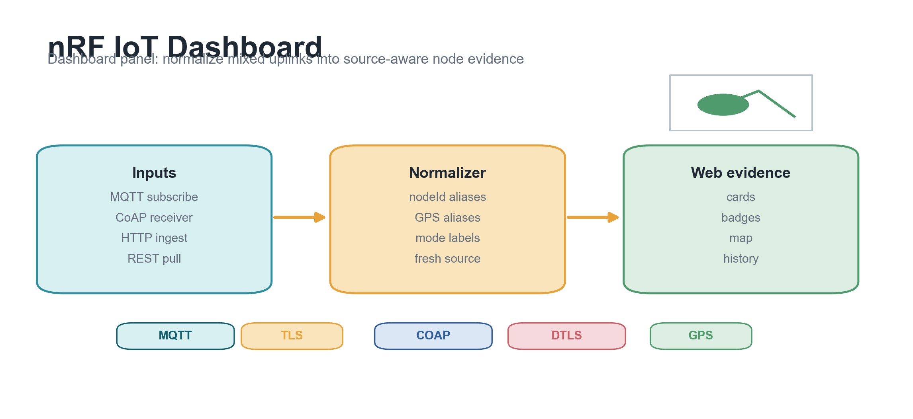

# nRF IoT Dashboard



> 中文：面向 nRF/NB-IoT 节点的 Web 面板，统一展示 MQTT、CoAP、HTTP 和 REST 拉取进入的数据，支持节点卡片、历史趋势和 GPS 地图。
>
> English: Web dashboard for nRF/NB-IoT nodes. It normalizes MQTT, CoAP, HTTP ingest, and REST-pulled telemetry into node cards, history charts, and GPS map markers.

## 中文简介

这个仓库是 Nordic IoT Lab 的前端和轻量后端。它可以直接订阅 MQTT broker，也可以接收 CoAP/HTTP 上报，或者从已有服务器 REST 接口拉取快照。所有数据会被归一化为节点状态，然后展示在网页面板上。

适合用于：

- 看每个节点最后一次上报的数据
- 区分 MQTT plain、MQTT TLS、CoAP plain、CoAP DTLS 等来源
- 展示温湿度、电池、电压、RSSI、CO2、GPS 等字段
- 在 OpenStreetMap/Leaflet 地图上查看节点位置
- 从 PostgreSQL 查询历史趋势
- 作为部署在自有 HTTPS 域名后的 Web 控制台

## English Overview

This repository contains the dashboard service for Nordic IoT Lab. It can subscribe to an MQTT broker, receive CoAP/HTTP telemetry directly, or pull snapshots from an existing REST endpoint. Incoming payloads are normalized into node snapshots and rendered in the web UI.

Useful for:

- Viewing the latest telemetry per node
- Separating MQTT plain, MQTT TLS, CoAP plain, and CoAP DTLS sources
- Displaying temperature, humidity, battery, voltage, RSSI, CO2, and GPS fields
- Showing node positions on an OpenStreetMap/Leaflet map
- Querying historical trends from PostgreSQL
- Running behind your production HTTPS domain

## Data Flow / 数据流

```text
nRF firmware -> MQTT/CoAP/HTTP/REST -> dashboard backend -> normalized node store -> web UI
```

Supported ingestion paths:

- MQTT topic subscription, default `nrf/+/telemetry`
- CoAP JSON receiver, default `coap://0.0.0.0:5683`
- HTTP bridge endpoint, `POST /api/ingest`
- REST snapshot puller via `UPSTREAM_PULL_URL`

## Quick Start / 快速开始

```bash
npm install
cp .env.example .env
npm run dev
```

Open:

```text
http://localhost:8080
```

Run with Docker:

```bash
docker compose up -d --build
docker compose logs -f
```

## APIs / 接口

- `GET /api/health`
- `GET /api/nodes`
- `GET /api/nodes/:nodeId`
- `GET /api/nodes/:nodeId/history?limit=100`
- `GET /sensor`
- `POST /api/ingest`
- `POST /api/internal/store`
- `POST /api/pull-once`

Write endpoints require `API_WRITE_TOKEN`. Read endpoints are public by default for lab use;
set `READ_AUTH_TOKEN` before exposing the dashboard publicly.

## Payload Example / 数据示例

MQTT topic:

```text
nrf/nrf-001/telemetry
```

JSON payload:

```json
{
  "nodeId": "nrf-001",
  "mode": "mqtt_tls",
  "temperature": 24.6,
  "humidity": 53.1,
  "battery": 3710,
  "rssi": -65,
  "voltage": 3.71,
  "co2": 611,
  "lat": 31.2304,
  "lng": 121.4737
}
```

Accepted aliases include:

- Node ID: `nodeId`, `device_id`, `mac_last4`, `mac`
- Temperature: `temperature`, `temp`, `temp_c`
- Battery: `battery`, `battery_mv`, `battery_pct`
- GPS: `lat/lng`, `lat/lon`, `latitude/longitude`, `gps.lat/gps.lon`, `location.latitude/location.longitude`

## Production Deployment Profile / 生产部署配置

- Web panel: `https://your-dashboard.example`
- MQTT backend ingest: `mqtts://your-mqtt.example:8883`
- MQTT topic: `sensor/+/data`
- Optional REST snapshot: `GET https://your-ingest.example/sensor`

When EMQX is the single ingress, keep direct CoAP disabled in this service:

```env
COAP_ENABLED=false
MQTT_BROKER_URL=mqtts://your-mqtt.example:8883
MQTT_TOPIC=sensor/+/data
MQTT_CA_CERT_PATH=/app/certs/ca.pem
MQTT_ALLOW_INSECURE_TLS=false
READ_AUTH_TOKEN=replace_with_long_random_read_token
API_WRITE_TOKEN=replace_with_long_random_write_token
PG_SSL=true
PG_SSL_REJECT_UNAUTHORIZED=true
```

If direct CoAP ingest is enabled, set `COAP_AUTH_TOKEN` and require devices to include
`token` or `authToken` in the JSON payload.

## Release / 版本

Current dashboard baseline:

```text
v0.9.3
```

Previous production test baseline: `v0.9.0`.
